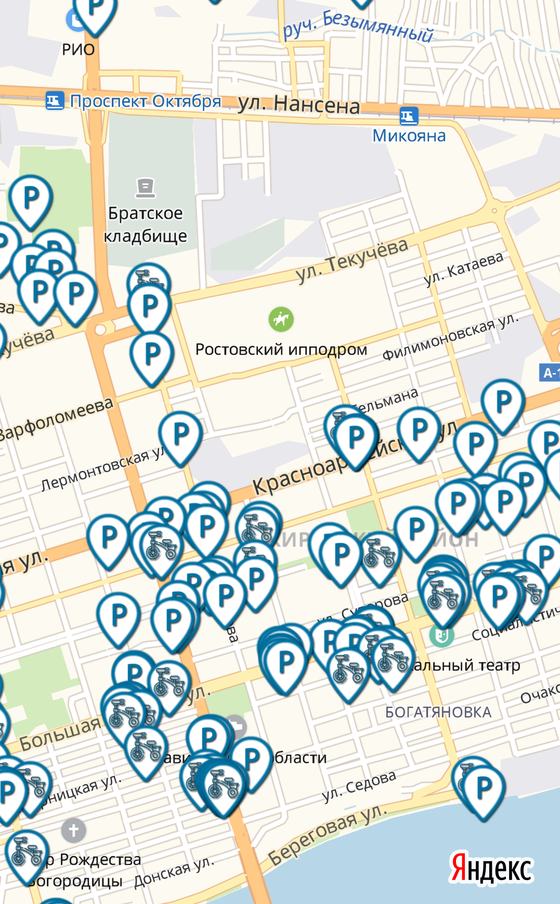
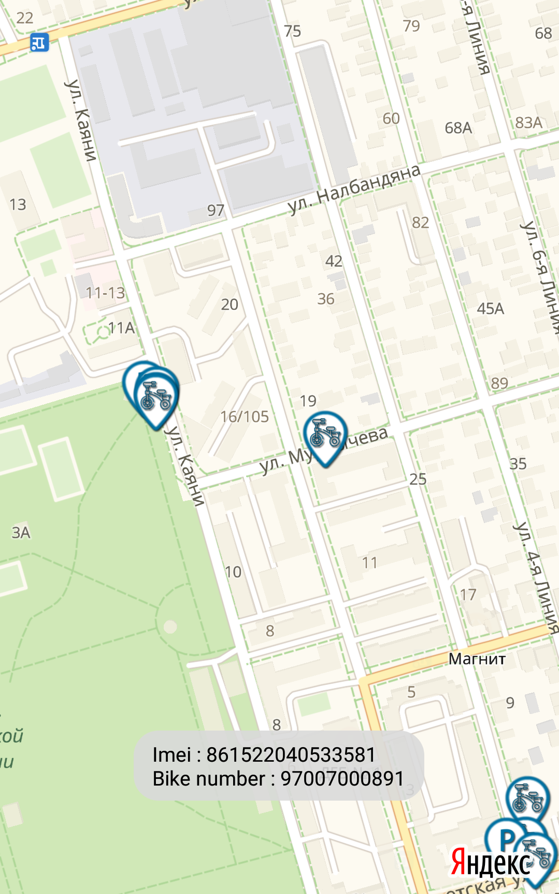
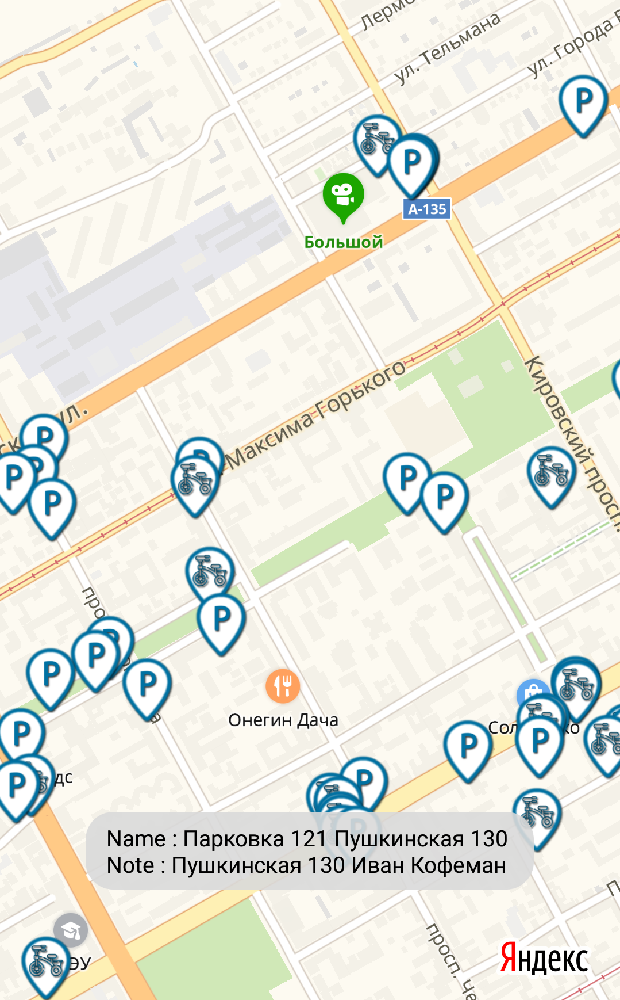

# SVAped
During the one-day SVA hackathon, the application "Lucky Bike" (https://play.google.com/store/apps/details?id=com.pgt.luckybike) was reverse engineered and an alternative client was created, allowing to interact with the backend of the original application.

Proof of concept
===============

 
 

